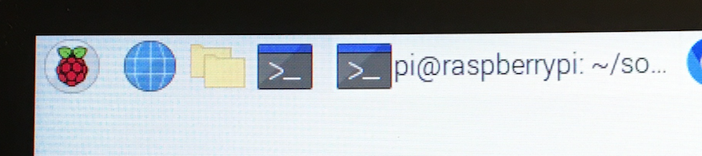
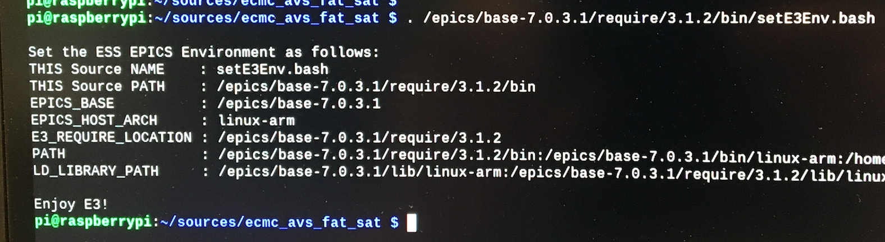

# ecmc_avs_fat_sat:
This repo is dedicated to the SAT/FAT commisoning/verification of components of the Target Drive Unit (TDU).
Components that can be tested:
* Stepper Motors (X,Y,Z) [Datasheet](doc/stepper/phytron_datasheet.pdf)
* Resolvers (X,Y,Z) [Datasheet](doc/stepper/phytron_datasheet.pdf)
* Switches (X,Y,Z) 
* Master AMO encoder (Rotation) [Datasheet](doc/amo_encoder/amosinEncoder.pdf)

[Hardware](doc/crate/overview.jpg)

## Startup of sat_fat_box:
1. Open Rittal box/crate
2. Connect white HDMI cable to a HDMI screen
3. Connect keyboard and mouse to white usb cables
4. Connect power cord to 3-phase power
5. Switch breaker in lower left corner to ON
6. The controller should now be starting up...

## Commisioning of one stepper axis:
Each stepper axis needs to be tested separately.

### Motor
1. Connect motor gnd to connector J2 of Technosoft drive.
2. Connect motor phases to conenctor J2 of Technosoft drive.

[Datasheet: iPOS8020, stepper drive](doc/crate/datasheets/iPOS8020_P029.026.E221.DSH_.10G.pdf)

### Limit switches:
Limits are feed from 24V digital output (EL2819) to 24V digital input (EL1004). There are two jumpers installed in the crate that should be replaced with the actual switches.
1. Connect low limit between output 1 of EL2819 and input 1 of EL1004(replace jumper with switch).
2. Connect high limit between output 2 of EL2819 and input 2 of EL1004 (replace jumper with switch).

[Datasheet: EL2819, 24V output terminal](doc/crate/datasheets/EL2819.pdf)

[Datasheet: EL1004, 24V input terminal](doc/crate/datasheets/EL1004.pdf)


### Resolver:
The Resolver should be connected to the EL7201 terminal.

[Datasheet: El7201, resolver input terminal](doc/crate/datasheets/EL7201.pdf)


### ecmc EPICS ioc
The EtherCAT hardware in the crate is controlled by an [EPICS](https://epics.anl.gov) module called [ecmc](https://github.com/epics-modules/ecmc) and configured through a epics module called [ecmccfg](https://github.com/paulscherrerinstitute/ecmccfg). All needed softwares have already been installed on the controller. 

#### Prepare shell
1. Start a new terminal window (press black button ">_" in upper left corner of screen):



2. Go to the ecmc_avs_fat_sat repo top dir:
```
cd sources/ecmc_avs_fat_sat
```
3. Set paths to EPICS binaries:
```
. /epics/base-7.0.3.1/require/3.1.2/bin/setE3Env.bash

```



#### Start ioc for stepper axis:
An EPICS ioc (input/output controller) needs to be started in order to control the hardware. The "fat_sat.script" file contains configurations of hardware for running a stepper axis with a pythron motor.
```
iocsh.bash fat_sat.script
```

To exit the iocsh (if needed) type "exit" or ctrl-C keys 
```
exit
```

### PYQT GUI
All data is accessiblie in the iocsh but sometimes it's simpler with a graphical GUI. The graphical GUI is generic and can be used to control motors and to read/write data. 

#### Prepare shell and start GUI
1. Start a new terminal/shell by pressing the blach button ">_" in upper left corner of screen 
2. Activate conda environment in order to use the correct python module versions
```
source activate ecmccomgui_py35
```

3. Go to GUI repo:
```
cd
cd source/ecmccomgui
```
4. Start GUI:

```
python ecmcGuiMain.py
```
5. Choose process variable (PV = IOC_TEST:Axis1):

ioc prefix: "IOC_TEST:"

pv name: "Axis1"


6. Start GUI for stepper axis:

press the "open gui" button

#### Start GUI for resolver:

```
 TODO
```

## Commisioning of AMO encoder

### Hardware
1. Connect the circluar multipole connecter to the AMO encoder box


