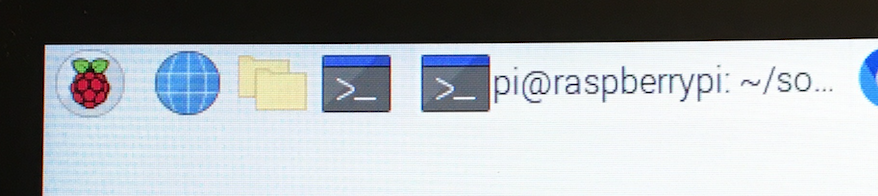
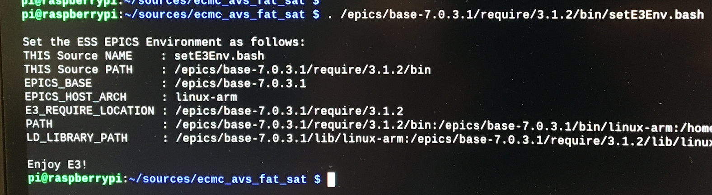

# ecmc_avs_fat_sat: Bifrost
This file describes the work flow for commisoing of the stepper of the Bifrost instrument

## Commisioning of one stepper axis:
Each stepper axis needs to be tested separately.

### Motor
1. Connect motor gnd to connector J2 of Technosoft drive (important!!).
2. Connect motor phases to conenctor J2 of Technosoft drive.

[Datasheet: iPOS8020, stepper drive](doc/crate/datasheets/iPOS8020_P029.026.E221.DSH_.10G.pdf)

### Limit switches:
Limits are feed from 24V digital output (EL2819) to 24V digital input (EL1004). There are two jumpers installed in the crate that should be replaced with the actual switches.
1. Connect low limit between output 1 of EL2819 and input 1 of EL1004(replace jumper with switch).
2. Connect high limit between output 2 of EL2819 and input 2 of EL1004 (replace jumper with switch).

[Datasheet: EL2819, 24V output terminal](doc/crate/datasheets/EL2819.pdf)

[Datasheet: EL1004, 24V input terminal](doc/crate/datasheets/EL1004.pdf)


### SSI encoder:
The encofder should be connected to the EL5002 terminal.

[Datasheet: EL5002, SSI encoder input terminal](doc/crate/datasheets/EL5002.pdf)

### ecmc EPICS ioc
The EtherCAT hardware in the crate is controlled by an [EPICS](https://epics.anl.gov) module called [ecmc](https://github.com/epics-modules/ecmc) and configured through a epics module called [ecmccfg](https://github.com/paulscherrerinstitute/ecmccfg). All needed softwares have already been installed on the controller. 

#### Prepare shell
1. Start a new terminal window (press black button ">_" in upper left corner of screen):



2. Go to the ecmc_avs_fat_sat repo top dir:
```
cd sources/ecmc_avs_fat_sat
```
3. Set paths to EPICS binaries:
```
. /epics/base-7.0.3.1/require/3.1.2/bin/setE3Env.bash

```



#### Start ioc for stepper axis:
An EPICS ioc (input/output controller) needs to be started in order to control the hardware. The "fat_sat.script" file contains configurations of hardware for running a stepper axis with a Stögra motor.
```
iocsh.bash bifrost.script
```

To exit the iocsh (if needed) type "exit" or ctrl-C keys 
```
exit
```

### PYQT GUI
All data is accessiblie in the iocsh but sometimes it's simpler with a graphical GUI. The graphical GUI is generic and can be used to control motors and to read/write data. 

#### Prepare shell and start GUI
1. Start a new terminal/shell by pressing the blach button ">_" in upper left corner of screen 
2. Activate conda environment in order to use the correct python module versions
```
source activate ecmccomgui_py35
```

3. Go to GUI repo:
```
cd
cd source/ecmccomgui
```
4. Start GUI:

```
python ecmcGuiMain.py
```
5. Choose process variable (PV = IOC_TEST:Axis1):

ioc prefix: "IOC_TEST:"

pv name: "Axis1"


6. Start GUI for stepper axis:

press the "open gui" button

#### Start GUI for Encoder:

```
 TODO
```

