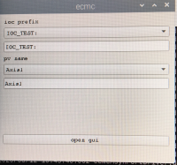

# ecmc_avs_fat_sat: Bifrost
This file describes the work flow for commisoing of the stepper of the Bifrost instrument

## Commisioning of one stepper axis:
Each stepper axis needs to be tested separately.

### Motor
1. Connect motor gnd to connector J2 of Technosoft drive (important!!).
2. Connect motor phases to conenctor J2 of Technosoft drive.

[Datasheet: iPOS8020, stepper drive](doc/crate/datasheets/iPOS8020_P029.026.E221.DSH_.10G.pdf)

### Limit switches:
Limits are feed from 24V digital output (EL2819) to 24V digital input (EL1004). There are two jumpers installed in the crate that should be replaced with the actual switches.
1. Connect low limit between output 1 of EL2819 and input 1 of EL1004(replace jumper with switch).
2. Connect high limit between output 2 of EL2819 and input 2 of EL1004 (replace jumper with switch).

[Datasheet: EL2819, 24V output terminal](doc/crate/datasheets/EL2819.pdf)

[Datasheet: EL1004, 24V input terminal](doc/crate/datasheets/EL1004.pdf)


### SSI encoder:
The encofder should be connected to the EL5002 terminal.

[Datasheet: EL5002, SSI encoder input terminal](doc/crate/datasheets/EL5002.pdf)


### ecmc EPICS ioc
The EtherCAT hardware in the crate is controlled by an [EPICS](https://epics.anl.gov) module called [ecmc](https://github.com/epics-modules/ecmc) and configured through a epics module called [ecmccfg](https://github.com/paulscherrerinstitute/ecmccfg). All needed softwares have already been installed on the controller. 

Notes on motor configuration:
The hardware is currently configured to run a stepper motor in open loop in the unit motor degrees (360 correspons to one rev of the motor). Any gears have not yet been configured. If needed the motion can be configured to any unit or scaling needed. Then please supply information on gears and scalings (from motor axis to the desired unit).

Notes on encoder configuration:
The Posital encoder have not yet been included in the configuration since ESS did not have a encoder of this type. Encoders have been ordered so a configuration file will be available within short. Please contact anders.sandstrom@esss.se for information.

#### Prepare shell
1. Start a new terminal window (press black button ">_" in upper left corner of screen):


2. Go to the ecmc_avs_fat_sat repo top dir:
```
cd sources/ecmc_avs_fat_sat
```
3. Set paths to EPICS binaries:
```
. /epics/base-7.0.3.1/require/3.1.2/bin/setE3Env.bash

```


#### Start ioc for stepper axis:
An EPICS ioc (input/output controller) needs to be started in order to control the hardware. The "fat_sat.script" file contains configurations of hardware for running a stepper axis with a Stögra motor.
```
iocsh.bash bifrost.script
```

To exit the iocsh (if needed) type "exit" or ctrl-C keys 
```
exit
```

### PYQT GUI
All data is accessiblie in the iocsh but sometimes it's simpler with a graphical GUI. The graphical GUI is generic and can be used to control motors and to read/write data. 

#### Prepare shell and start GUI
1. Start a new terminal/shell by pressing the blach button ">_" in upper left corner of screen 
2. Activate conda environment in order to use the correct python module versions

```
source activate ecmccomgui_py35
```


3. Go to GUI repo:
```
cd
cd source/ecmccomgui
```

4. Start GUI:

```
python ecmcGuiMain.py
```


5. Choose process variable (PV = IOC_TEST:Axis1):

ioc prefix: "IOC_TEST:"

pv name: "Axis1"



6. Start GUI for stepper axis:

press the "open gui" button

The following GUI should appear:


Item | Field | Description | R/W
--- | --- | --- | ---|
1 | NAME | Name of axis | R
2 | DESC | Description of axis | R
3 | EGU | Unit for motion axis | R
4 | RBV | Readback value (encoder or stepcounter) with unit specified in EGU | R
5 | VAL | Position setpoint with unit specified in EGU.  | RW
6 | VELO | Velocity setpoint for positioning unit EGU/second | RW
7 | MSTA | Status word | R
8 | TWEAK group | Move relative a certain distance. Push left button to move backward and right button forward | RW
9 | TWEAK distance| Center textbox in tweak group defines the distance to move | RW
10 | TWEAK "<<" | Initiate relative move backward | RW
11 | TWEAK ">>" | Initiate relative move forward | RW
12 | TWEAK "/10" | Divide tweak distance with 10 | RW
13 | TWEAK "*10" | Multiply tweak distance with 10 | RW
14 | JOG group | Continious movement backward or forward | RW
15 | JVEL | Jog velocity (EGU/second) | RW
16 | JOGR | Initiate backward jog | RW
17 | JOGF | Initiate forward jog | RW
18 | HOMR | Initiate homing sequence | RW
19 | HOMF | Initiate homing sequence (same as HOMR) | RW
20 | STOP | Stop motion | RW
21 | CNEN | Enable/disable amplifier | RW
22 | RESET | Reset any error | RW


#### Start GUI for Encoder:

```
 TODO
```

