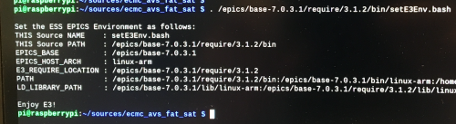

# ecmc_avs_fat_sat: Target
This file describes the work flow for commisoing of the stepper of the Target instrument

### Motor
1. Connect motor gnd to connector J2 of Technosoft drive (important!!).
2. Connect motor phases to conenctor J2 of Technosoft drive.

[Datasheet: iPOS8020, stepper drive](doc/crate/datasheets/iPOS8020_P029.026.E221.DSH_.10G.pdf)

#### Change motor current
The delivery state setting of the motor current is 10A. Measurement of the actual current showed that a setting of 12A approx corresponds to 10A RMS.

The current can be changes by updating the ECMC_EC_DRIVE_CURRENT variable in the  [target.script](target.script) file. 

NOTE: The current can only be changed in integer steps of Amps int the range 1A..14A.

Example: Set current to 5A
```
# Several current settings are available for this motor (2A..14A). Motor max current is 10A RMS
# NOTE: Setting 12A results in approx 10A RMS current (measured with current clamps and scope)
epicsEnvSet("ECMC_EC_DRIVE_CURRENT",          "5")     # Set current in Amps here (only integers)
```

NOTE: After updating the [target.script](target.script) the EPICS ioc needs to be restarted in order to load the new setting.

### Limit switches:
Limits are feed from 24V digital output (EL2819) to 24V digital input (EL1004). There are two jumpers installed in the crate that should be replaced with the actual switches.
1. Connect low limit between output 1 of EL2819 and input 1 of EL1004(replace jumper with switch).
2. Connect high limit between output 2 of EL2819 and input 2 of EL1004 (replace jumper with switch).

[Datasheet: EL2819, 24V output terminal](doc/crate/datasheets/EL2819.pdf)

[Datasheet: EL1004, 24V input terminal](doc/crate/datasheets/EL1004.pdf)


### Resolver:
The Resolver should be connected to the EL7201 terminal.

[Datasheet: El7201, resolver input terminal](doc/crate/datasheets/EL7201.pdf)


### ecmc EPICS ioc
The EtherCAT hardware in the crate is controlled by an [EPICS](https://epics.anl.gov) module called [ecmc](https://github.com/epics-modules/ecmc) and configured through a epics module called [ecmccfg](https://github.com/paulscherrerinstitute/ecmccfg). All needed softwares have already been installed on the controller. 

Notes on motor configuration:
The hardware is currently configured to run a stepper motor in open loop in the unit motor degrees (360 correspons to one rev of the motor). Any gears have not yet been configured. If needed the motion can be configured to any unit or scaling needed. Then please supply information on gears and scalings (from motor axis to the desired unit).

Notes on resolver configuration:
The reolsvers have not yet been scaled. However, it should be enough to see that you get increasing/decreasing signal on the resolver while running the stepper motor.

#### Prepare shell
1. Start a new terminal window (press black button ">_" in upper left corner of screen):


2. Go to the ecmc_avs_fat_sat repo top dir:
```
cd sources/ecmc_avs_fat_sat
```
3. Set paths to EPICS binaries:
```
. /epics/base-7.0.3.1/require/3.1.2/bin/setE3Env.bash

```



#### Start ioc for stepper axis:
An EPICS ioc (input/output controller) needs to be started in order to control the hardware. The "fat_sat.script" file contains configurations of hardware for running a stepper axis with a pythron motor.
```
iocsh.bash target.script
```

To exit the iocsh (if needed) type "exit" or ctrl-C keys 
```
exit
```
## PYQT GUI
Some instruction on how to start a GUI can be found here:
 [GUI](https://github.com/anderssandstrom/ecmccomgui/blob/master/README_gui.md)

### Intressting PVs for use in GUI

Item | Prefix| Pv name | Description
--- | --- | --- | --- |
1 | IOC_TEST: | Axis1  | Motor record for stepper
2 | IOC_TEST: | ec0-s4-EL5021-PosAct  | SinCos encoder terminal Actual position (Amo encoder) [raw counts]
3 | IOC_TEST: | ec0-s5-EL7201-Enc-PosAct  | Resolver  terminal Actual position [raw counts]

## Command line utilities

Data is also accessible through command line tools:

* camonitor <prefix><pv name>       : Continiously print new values of the selected pv when the value changes
 
* caput <prefix><pv name> <value>   : Write value to the  selected pv
 
* caget <prefix><pv name>           : Read value of selected pv 
 
NOTE: These commands are only accesible in a prepared shell (see heading above).
(You need to run this command . /epics/base-7.0.3.1/require/3.1.2/bin/setE3Env.bash in the terminal)
 
Example: 
```
camonitor IOC_TEST:ec0-s4-EL5021-PosAct

IOC_TEST:ec0-s4-EL5021-PosAct 2020-09-29 16:19:49.907665 750
IOC_TEST:ec0-s4-EL5021-PosAct 2020-09-29 16:19:49.908665 751
IOC_TEST:ec0-s4-EL5021-PosAct 2020-09-29 16:19:49.909665 752
IOC_TEST:ec0-s4-EL5021-PosAct 2020-09-29 16:19:49.910665 753
IOC_TEST:ec0-s4-EL5021-PosAct 2020-09-29 16:19:49.911665 754
...

```

## Verifcation of AMO encoder

Instructions on how to verify AMO encoder functionality:

[AMO verification](README_Target_Amo.md)

