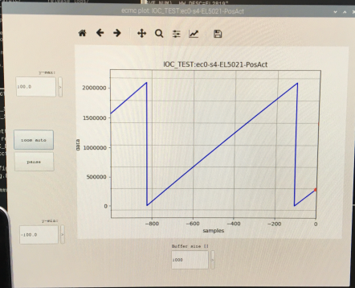

# Verification of AMO sin/cos enocoder 

## AMO encoder

The AMO encoder is of type sin/cos 1VPP ([Datasheet](doc/amo_encoder/amosinEncoder.pdf)).
The encoder is equipped with 2 tracks:
1. Incremental track (A,A/ and B,B/)
2. Reference track (C,C/)

The incremental track is a high resolution track. Evaluation of this track results in a relative position.
The reference track gives just one pulse per revolution and can therefore be used to reference the encoder.
Some encoder reading terminals, like EL5021, can be configured to reset the encoder value to zero (or other value) when passing the refernce pulse.
The ecmc configuration of the el5021 in "this" crate is configured to reset the encoder value to zero when passing the reference pulse.

## Alignment
It is important that the encoder reading head is mounted according to the specifications in relation to the reading head (it needs careful alignment).
Without a proper alignment one or both of the tracks could stop working.

Note: Also make sure the reading is not mounted upside down (teh two tracks on reading head must be aligned with the tracks on the scale).

## Verification of encoder
In order to verify the encoder mounting, that both tracks work properlly, the encoder needs to be connected to the EL5021 terminal in the crate. The connection is prepared with a cable and M23 conenctor that fits the encoder electronics box.

Follow these steps to verify encoder:
1. Connect AMO encoder to M23 connector
2. Start the ecmc EPICS ioc (follow the steps in [Target](README_Target.md))
3. Start the PYQT graphical user interface (follow the steps in  [GUI](https://github.com/anderssandstrom/ecmccomgui/blob/master/README_gui.md)).
4. Monitor the encoder actual position by choosing: 
   * Prefix  = "IOC_TEST:"
   * Pv name = "ec0-s4-EL5021-PosAct"
5. Rotate axis
6. If the ecnoder is mounted and connected correct the ecnoder value shold look like a saw tooth graph for each revolution (since encoder counter is reset to zero on reference track).

Example:

If the graph looks like this the encoder is mounted and connected properly if not further adjustemts are needed.

NOTE: The command line utilities can also be used to monitor the encoder value (see [Target](README_Target.md))

