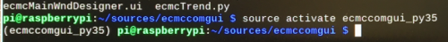
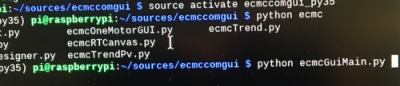
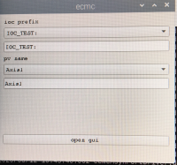
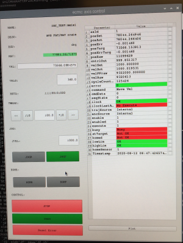

# ecmc_avs_fat_sat: PYQT GUI

All data is accessiblie in the iocsh but sometimes it's simpler with a graphical GUI. The graphical GUI is generic and can be used to control motors and to read/write data. 

#### Prepare shell and start GUI
1. Start a new terminal/shell by pressing the blach button ">_" in upper left corner of screen 
2. Activate conda environment in order to use the correct python module versions

```
source activate ecmccomgui_py35
```


3. Go to GUI repo:
```
cd
cd source/ecmccomgui
```

4. Start GUI:

```
python ecmcGuiMain.py
```


5. Choose process variable (PV = IOC_TEST:Axis1):

ioc prefix: "IOC_TEST:"

pv name: "Axis1"



6. Start GUI for stepper axis:

press the "open gui" button

The following GUI for the EPICS motor record should appear:



The GUI is devided into two panels:

* The left panel is for control and EPICS motor record specific status and control.

* The right panel shows additional status of the ecmc motion axis

The different fields for the left side of the panel are explained in the below table.

Item | Field | Description | R/W
--- | --- | --- | ---|
1 | NAME | Name of axis | R
2 | DESC | Description of axis | R
3 | EGU | Unit for motion axis | R
4 | RBV | Readback value (encoder or stepcounter) with unit specified in EGU | R
5 | VAL | Position setpoint with unit specified in EGU.  | RW
6 | VELO | Velocity setpoint for positioning unit EGU/second | RW
7 | MSTA | Status word | R
8 | TWEAK group | Move relative a certain distance. Push left button to move backward and right button forward | RW
9 | TWEAK distance| Center textbox in tweak group defines the distance to move | RW
10 | TWEAK "<<" | Initiate relative move backward | RW
11 | TWEAK ">>" | Initiate relative move forward | RW
12 | TWEAK "/10" | Divide tweak distance with 10 | RW
13 | TWEAK "*10" | Multiply tweak distance with 10 | RW
14 | JOG group | Continious movement backward or forward | RW
15 | JVEL | Jog velocity (EGU/second) | RW
16 | JOGR | Initiate backward jog | RW
17 | JOGF | Initiate forward jog | RW
18 | HOMR | Initiate homing sequence | RW
19 | HOMF | Initiate homing sequence (same as HOMR) | RW
20 | STOP | Stop motion | RW
21 | CNEN | Enable/disable amplifier | RW
22 | Reset Error | Reset any error | RW

The different fields for the right side of the panel are explained in the below table.

Item | Field | Description | R/W
--- | --- | --- | ---|
1 | axId | Index of axis | R
2 | posSet | Current position setpoint (trajectory) | R
3 | posAct | Actual position | R
4 | posErr | Current position error (following error) | R
5 | posTarg | Target position (where motion should stop) | R
6 | posErrTarg | Distance untill target position | R
7 | posRaw | Current raw unscaled actual position | R
8 | ctrlOut | Output of PID controller including feedforward | R
9 | velSet | Current velocity setpoint| R
10 | velAct | Actual velocity | R
11 | velFFRaw | Raw velocity feedforward (in drive units)| R
12 | velRaw | Raw velocity setpoint (in drive units) | R
13 | cycleCounter | RT thread cycles | R
14 | error | Error code | R
15 | Command | Current motion mode (positioning, constant velo, homing,..)  | R
16 | Command data | Additional motion mode parameter. For homing, it's the homing procedure type | R
17 | Seq state | Shows state of current sequence (only used for homig sequences)| R
18 | ilock | Shows any interlock that prevents motion| R
19 | ilocklast | Shows last interlock that prevented motion| R
20 | trajsource | Shows if axis position setpoint is from local trajectory generator or PLC | R
21 | encsource | Shows if axis actual position  is from local trajectory generator or PLC | R
22 | enable | Enable amplifier command | R
23 | enabled | Amplifier enabled status | R
24 | execute | Motion move execute (rising edge triggers new motion and falling edge stops motion) | R
25 | busy | Axis busy status | R
26 | atTarget | Axis is within a certain tolerance from target position | R
27 | homed | Axis is homed (referenced or absolute encoder) | R
28 | lowLim | Low limit switch status (backward, high allows motion low interlocks motion) | R
29 | highLim |High  limit switch status (forward, high allows motion low interlocks motion) | R
30 | homeSensor |Status of home/reference sensor (if any) | R
31 | Timestamp | EPICS timestamp of data | R

#### Issue a positioning command:

1. Ensure that it is safe for the motor to be powered and move. Always have the E-stop within reach.
2. Ensure that there are no error code. If error, try to reset by the "Reset Error"
3. Ensure that the VELO field contains a resonable velocity.
4. Enable the amplifier by pushing the CNEN button. The CNEN button should turn green and the status "enabled" should show "1". can take a few seconds.
5. Enter a new target position in the "VAL" field. The motor should start rotating twoards the new target position.
6. The motor can be stopped by pressing the "STOP" button (or in worst case CNEN button (not good for electronics) or finaly E-Stop button).


#### Issue a jog command:

1. Ensure that it is safe for the motor to be powered and move. Always have the E-stop within reach.
2. Ensure that there are no error code. If error, try to reset by the "Reset Error"
3. Ensure that the JVEL field contains a resonable velocity.
4. Enable the amplifier by pushing the CNEN button. The CNEN button should turn green and the status "enabled" should show "1". can take a few seconds.
5. Press the "JOGF" button for forward motion or the "JOGR" button for backward motion.
6. The motor can be stopped by pressing the "STOP" button (or in worst case CNEN button (not good for electronics) or finaly E-Stop button).

